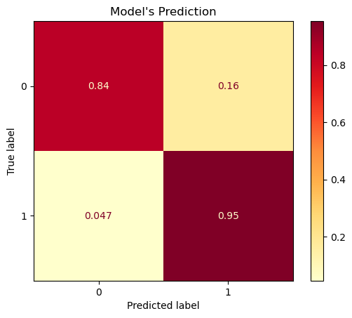
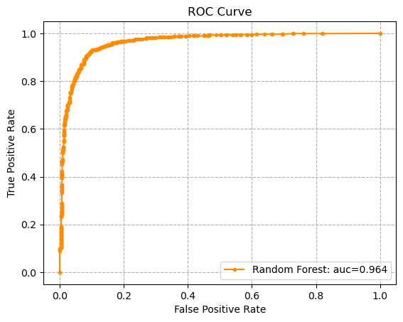

# Customer Churn Prediction using Machine Learning

This project focuses on building a predictive model to identify customers at risk of churning. By analyzing customer data, we aim to understand the factors influencing churn and leverage machine learning techniques to predict which customers are likely to leave, enabling proactive retention strategies.

## Table of Content

- [Dataset](#dataset)
- [Key Findings](#data-analysis-key-findings)
- [Sample Visualization](#sample-visualization)
- [Technologies Used](#technologies-used)
- [License](#license)

## Dataset

The dataset used in this analysis is WA_Fn-UseC_-Telco-Customer-Churn.csv. It contains information about a telecommunications company's customers and is used to predict customer churn.

**Key features include:**
- Gender: The customer's gender.
- SeniorCitizen: Whether the customer is a senior citizen.
- tenure: The number of months the customer has stayed with the company.
- InternetService: The customer's internet service provider (DSL, Fiber optic, etc.).
- Contract: The type of contract the customer has (e.g., Month-to-month, One year).
- MonthlyCharges: The amount charged to the customer on a monthly basis.
- TotalCharges: The total amount charged to the customer over their tenure.
- Churn: The target variable, indicating if the customer churned (Yes) or not (No).

## Data Analysis Key Findings

*   **The Project Primary Goal** The project aims to predict customer churn using machine learning, identifying at-risk customers and factors influencing churn for proactive retention.
*   **Data Loading and Cleaning:** The analysis involved data loading, cleaning (handling missing `TotalCharges` and converting to numeric), and preprocessing (encoding binary features).
*   **Exploratory Data Analysis (EDA):** included visualizing numerical features and using Chi-squared tests to identify significant relationships between most categorical features and `Churn`.
*   **Data Imbalance:** The project addressed data imbalance in the target variable `Churn` using Random Oversampling.
*   **Feature Engineering:** splitting data, one-hot encoding categorical features with >2 unique values, and scaling numerical features.
*   **Model Selection and Evaluation:** Several classification models were trained and evaluated using cross-validation, with `RandomForestClassifier` showing the highest average accuracy of 0.87.
*   **Hyperparameter Tuning:** Hyperparameter tuning was performed on `RandomForestClassifier` using Grid Search, resulting in the best parameters: `{'max_depth': 20, 'max_features': 'sqrt', 'min_samples_leaf': 1, 'min_samples_split': 2, 'n_estimators': 100}`.
*   **Model Evaluation:** The final model was evaluated using various metrics. The precision score is 0.90, recall score is 0.90, f1 score is 0.90. The confusion matrix showed that the model performs well in identifying both churned (recall of 0.95) and non-churned customers (recall of 0.84). The ROC curve and AUC score of 0.964 demonstrate the model's strong ability to discriminate between the two classes.

## Sample Visualization

### 1. Distribution of Numerical Features

### 2. Model Performance

### 3. ROC Curve and AUC

## Technologies Used

*   pandas: For data manipulation and analysis.
*   numpy: For numerical operations.
*   matplotlib: For creating visualizations.
*   seaborn: For statistical data visualization based on matplotlib.
*   scipy: For scientific and technical computing, specifically for the chi-squared test.
*   sklearn: For machine learning model selection, preprocessing (OneHotEncoder, StandardScaler), model training (SVC, XGBClassifier, DecisionTreeClassifier, LogisticRegression, KNeighborsClassifier, RandomForestClassifier), model evaluation (accuracy_score, classification_report, ConfusionMatrixDisplay, precision_score, recall_score, f1_score, roc_curve, auc), and model selection utilities (train_test_split, cross_val_score, GridSearchCV).
*   imblearn: For handling imbalanced datasets, specifically using RandomOverSampler.

## License
This project is licensed under the [MIT License](LICENSE).
You are free to use, modify, and share this project, provided proper attribution is given.